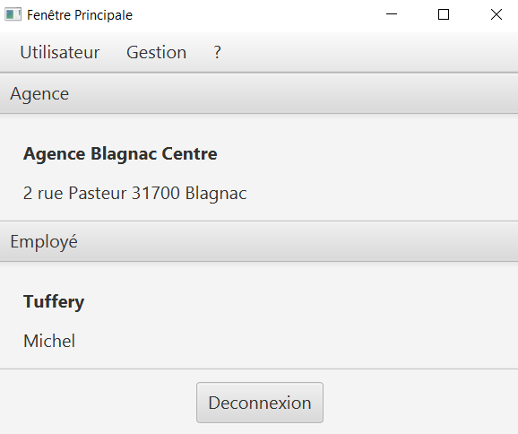
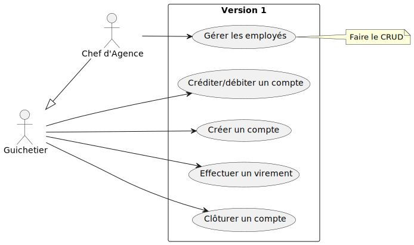
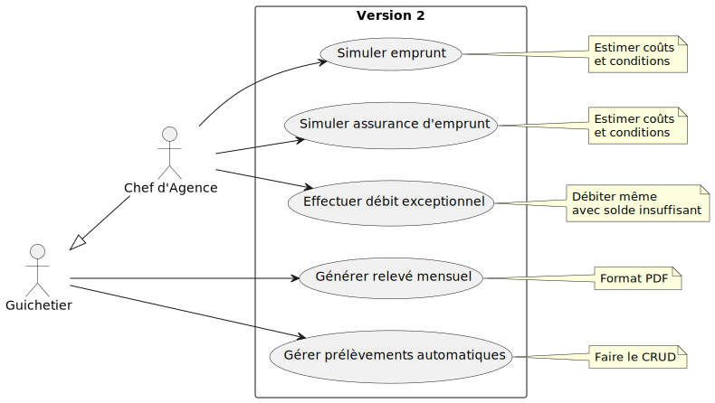

= Cahier des Charges - Version 2
:toc:
:toc-title: Sommaire

== Informations Générales

[cols="2*"]
|===
| Projet | Développement de l'application JAVA-Oracle pour la gestion des comptes clients

| Client | Banque DailyBank

| Date | Mai 2024

| Version | 2
|===
|===
| Équipe |

| Chef de Projet | Thomas AUSSENAC
| Membres | Loïc PHRAKOUSONH, Jules GIARD--PELLAT, Clément RICHAUDEAU

|===

== Présentation du Sujet

=== Contexte
Aujourd'hui, la numérisation des systèmes est devenue la norme,
c'est pour cela que le secteur bancaire est confronté à une transformation majeure due à la montée en puissance des applications financières, notamment les applications mobiles qui accélère sa croissance alimentée par l’arrivée des jeunes sur le marché. Les banques traditionnelles doivent s'adapter pour rester compétitives face à de nouveaux entrants axés sur l'expérience utilisateur digitale. Cette évolution est cruciale face aux nouveaux entrants spécialisés dans les services bancaires numériques.
De plus, les banques doivent disposer d'une interface assez intuitive, car une mauvaise expérience utilisateur peut directement affecter la réputation de la banque.

=== Objectifs
Le projet consiste à développer une application JAVA-Oracle de gestion des comptes clients pour la banque DailyBank, visant à améliorer les outils déjà existants. L'application sera déployée dans les 100 agences du réseau de la banque. L'application pourra débiter, créditer un compte soit par virement c’est à dire un échange d’argent entre deux comptes distincts mais domiciliés dans le réseau bancaire, soit par une personne physique se présentant devant un guichet.

== Analyse de l’Existant
.Diagramme des Cas d’Utilisation initial V0
image::DCV0.svg[]

L'application existante "Daily Bank" (Version V0) permet aux guichetiers et chefs d'agence d'effectuer certaines actions de base sur les comptes clients :

- Modification des Informations Client :
Les guichetiers et chefs d'agence peuvent mettre à jour les informations des clients, telles que l'adresse, le téléphone, etc. Cette fonctionnalité est essentielle pour maintenir des données client précises.
- Création d'un Nouveau Client :
Il est possible de créer un nouveau profil client dans le système. Cette fonctionnalité permet d'ajouter de nouveaux clients à la base de données de la banque.
- Consultation de Comptes :
Les guichetiers et chefs d'agence peuvent accéder aux informations des comptes clients, y compris les soldes, les informations des clients etc.
- Débit d'un Compte :
Il est possible d'effectuer des opérations de débit sur les comptes clients. Cette fonctionnalité permet d'effectuer des transactions de retrait d'argent.
- Rendre Inactif un Client :
Les chefs d'agence peuvent désactiver un profil client dans le système, ce qui peut être utile pour des comptes inutilisés. 

Il y a un jar exécutable V0 qui représente l'application "Daily Bank" qui permet de se connecter en tant que guichetier ou chef d'agence grâce à un nom d'utilisateur et un mot de passe et d'effectuer les actions au dessus

.Capture d'écran de l'interface jar V0

== Analyse des besoins incluant V0 et V1

=== Besoins Fonctionnelles :
.Diagramme des Cas d’Utilisation initial V1
 

.Diagramme des Cas d’Utilisation initial V2

- Créditer :
Saisir le numéro de compte à créditer et le montant
Vérifier que le montant est positif
Mettre à jour le solde du compte en conséquence
Enregistrer la transaction dans la base de données

- Débiter un compte :
Saisir le numéro de compte à débiter et le montant
Vérifier que le compte a un solde suffisant (ou que le découvert autorisé n'est pas dépassé)
Mettre à jour le solde du compte en conséquence
Enregistrer la transaction dans la base de données

- Consulter un compte :
Rechercher le compte client à partir de son numéro de compte
Afficher les informations du compte (numéro, solde, historique des opérations, etc.)

- Créer un compte :
Récupérer les informations du nouveau client (nom, prénom, adresse, etc.)
Générer un numéro de compte unique
Créer le nouveau compte dans la base de données avec un solde initial
Retourner les informations du nouveau compte créé

- Effectuer un virement de compte à compte :
Saisir les numéros de compte émetteur et bénéficiaire, ainsi que le montant
Vérifier que le compte émetteur a un solde suffisant
Débiter le compte émetteur et créditer le compte bénéficiaire
Enregistrer la transaction dans la base de données

- Clôturer un compte :
Rechercher le compte à clôturer à partir de son numéro
Vérifier que le solde du compte est nul
Supprimer le compte de la base de données
Retourner un message de confirmation de clôture

- Gestion des employés (guichetiers et chefs d'agence) :
Les chefs d'agence peuvent créer, consulter, modifier et supprimer les fiches des employés (guichetiers et chefs d'agence).

- Génération de relevés mensuels de compte en PDF :
Les guichetiers peuvent générer des relevés mensuels au format PDF pour un compte client, contenant le numéro de compte, le nom du titulaire, le solde et l'historique des opérations.

- Gestion des prélèvements automatiques :
Les guichetiers peuvent créer, consulter, modifier et supprimer les prélèvements automatiques associés aux comptes clients.

- Débit exceptionnel, simulation d'emprunt et d'assurance d'emprunt :
Les chefs d'agence peuvent effectuer un débit exceptionnel sur un compte, même en cas de solde insuffisant.
Les chefs d'agence peuvent simuler un emprunt et une assurance d'emprunt pour les clients.

=== Besoins non fonctionnels :

- Langage de programmation :
L'application doit être développée en utilisant le langage de programmation Java.
Java a été choisi car c'est le langage utilisé dans la version 0 de l'application.
- Système de gestion de base de données :
L'application doit utiliser le système de gestion de base de données (SGBD) Oracle.
- Sécurité :
L'application doit respecter les normes de sécurité bancaire en vigueur pour la gestion des comptes clients.

== Analyse des contraintes ◦ techniques et organisationnelles
=== Contraintes techniques :

- Utilisation de logiciels non optimisés (Win-Design) :
** L'application doit fonctionner avec l'IDE Java et le SGBD Oracle, qui sont les outils principalement utilisés par la banque DailyBank.
** Cependant, ces outils sont relativement anciens et moins performants que les dernières versions disponibles sur le marché.
** Notre équipe devra tenir compte des limitations et des problèmes potentiels liés à l'utilisation de ces outils moins optimisés.
 - Compatibilité entre systèmes d'exploitation :
** L'application doit être compatible avec les différents systèmes d'exploitation utilisés dans les agences bancaires de la banque DailyBank.
** Cela implique de s'assurer que l'application fonctionne correctement sur les différentes versions de Windows/Linux présentes dans les agences.
Des tests de compatibilité devront être effectués pour garantir le bon fonctionnement de l'application sur les systèmes d'exploitation cibles.

=== Contraintes organisationnelles :

- Réunions et coordination possibles uniquement sur des créneaux prévus :
** Les réunions de coordination entre nous ne pourront avoir lieu que sur des créneaux spécifiques.
Cette contrainte de disponibilité limitée pour les réunions devra être prise en compte dans la planification du projet afin de réussir notre projet.

== Modalités de Mise en Œuvre :
- Livraisons Attendues :
[cols="1,2",options=header]
|===
| Date    | Nom         
| Sem.18  | CDC V1                                               
|        |Gantt V1 Prévu
| 07/05  | CdC V2final
|         | Doc. Tec. V0     
|         | Doc User V0  
|         | Recette V0  
| 31/05   | Gantt V1  réalisé    
|         | Doc. Util. V1          
|         | Doc. Tec. V1      
|         | Code V1     
|         | Recette V1  
|         | Gantt V2 prévu  
| 14/06   | Gantt V2  réalisé    
|         | Doc. Util. V2          
|         | Doc. Tec. V2 
|         | Code V2     
|         | Recette V2  
|         | `jar` projet  
|===

